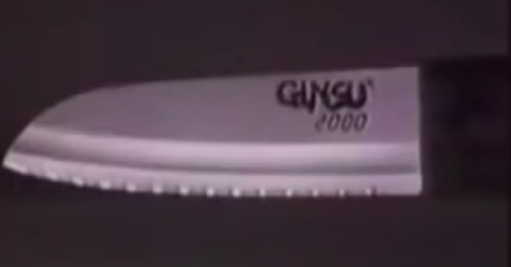

# Ginsu2000

**Número da Lista**: Floating point exception 
**Conteúdo da Disciplina**: Divide and Conquer 

## Alunos
|Matrícula | Aluno |
| -- | -- |
| 18/0033620  |  João Henrique C. Paulino |
| 18/0052845  |  Gabriela da Gama Pivetta |

## Sobre 
Sim, depois da faca [ginsu2000](https://www.youtube.com/watch?v=Kk9mYTmULr0&ab_channel=%C3%89Pav%C3%AA) ser capaz de cortar até mesmo um cano de ferro, a empresa 
Guinso LTDA está lançando a inovadora ginsu2048, 
que além de cortar a sola de um sapato é capaz
de dividir problemas de computação para que você
conquiste sua nota na faculdade.

Todos os códigos foram cortados com a inovadora ginsu2048.

## Screenshots

## Instalação 
**Linguagem**: C99 | C++17 | python3 

Pre requisitos python3, gcc e g++17 instalados.

## Uso 
Só mandar as questões para o site e id_questão do problema os dados das questões resolvidas podem ser encontrados no cabeçalho de cada arquivo.
